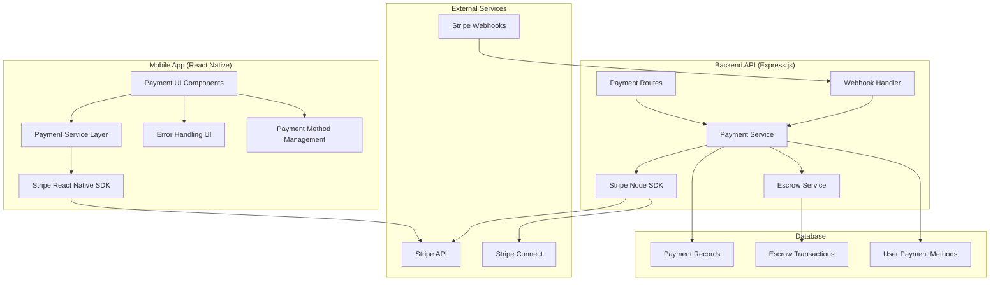

# Design Document: Payment Flow Improvements

## Overview

This design enhances the BarterDash payment system to provide a seamless, secure, and intuitive payment experience. The solution leverages Stripe's Payment Sheet for React Native, implements comprehensive error handling, and creates a unified payment management interface that supports both one-time purchases and escrow transactions.

The design focuses on three core areas:
1. **Enhanced UI/UX**: Modern, mobile-optimized payment interfaces using Stripe's pre-built components
2. **Robust Backend Integration**: Improved Stripe integration with proper error handling and webhook management
3. **Comprehensive Payment Management**: Full lifecycle payment tracking from initiation to completion

## Architecture

### High-Level Architecture



### Component Architecture

The payment system consists of several key components:

1. **Payment UI Layer**: React Native components using Stripe's Payment Sheet
2. **Payment Service Layer**: Business logic for payment processing and state management
3. **Backend Payment API**: Express.js routes handling Stripe operations
4. **Webhook Processing**: Real-time payment status updates
5. **Error Management**: Comprehensive error handling and user feedback

## Components and Interfaces

### Frontend Components

#### PaymentMethodManager Component
Manages saved payment methods with add, edit, delete, and default selection capabilities.

```typescript
interface PaymentMethodManagerProps {
  userId: string;
  onMethodSelected?: (methodId: string) => void;
  showAddButton?: boolean;
}

interface PaymentMethod {
  id: string;
  type: 'card' | 'bank_account';
  last4: string;
  brand: string;
  expiryMonth?: number;
  expiryYear?: number;
  isDefault: boolean;
  fingerprint: string;
}
```

#### EnhancedCheckout Component
Unified checkout interface supporting both saved and new payment methods.

```typescript
interface EnhancedCheckoutProps {
  orderId: string;
  amount: number;
  currency: string;
  onSuccess: (paymentResult: PaymentResult) => void;
  onError: (error: PaymentError) => void;
  onCancel: () => void;
}

interface PaymentResult {
  paymentIntentId: string;
  escrowId: string;
  status: 'succeeded' | 'requires_action' | 'processing';
}
```

#### PaymentStatusTracker Component
Real-time payment status display with progress indicators.

```typescript
interface PaymentStatusTrackerProps {
  paymentIntentId: string;
  escrowId?: string;
  onStatusChange?: (status: PaymentStatus) => void;
}

interface PaymentStatus {
  stage: 'initiated' | 'processing' | 'succeeded' | 'failed' | 'requires_action';
  message: string;
  actionRequired?: {
    type: '3d_secure' | 'verify_with_microdeposits';
    url?: string;
  };
}
```

### Backend Services

#### Enhanced Payment Service
Handles all payment operations with improved error handling and logging.

```typescript
class EnhancedPaymentService {
  async createPaymentIntent(
    userId: string, 
    orderId: string, 
    paymentMethodId?: string
  ): Promise<Result<PaymentIntentResponse, PaymentError>>

  async confirmPayment(
    paymentIntentId: string, 
    paymentMethodId?: string
  ): Promise<Result<PaymentConfirmation, PaymentError>>

  async savePaymentMethod(
    userId: string, 
    paymentMethodId: string
  ): Promise<Result<SavedPaymentMethod, PaymentError>>

  async getPaymentMethods(
    userId: string
  ): Promise<Result<PaymentMethod[], PaymentError>>

  async deletePaymentMethod(
    userId: string, 
    paymentMethodId: string
  ): Promise<Result<void, PaymentError>>
}
```

#### Webhook Event Handler
Processes Stripe webhooks for real-time payment updates.

```typescript
interface WebhookHandler {
  handlePaymentIntentSucceeded(event: Stripe.Event): Promise<void>;
  handlePaymentIntentFailed(event: Stripe.Event): Promise<void>;
  handlePaymentMethodAttached(event: Stripe.Event): Promise<void>;
  handleAccountUpdated(event: Stripe.Event): Promise<void>;
}
```

### API Endpoints

#### Payment Management Endpoints
```
POST   /api/payments/create-intent          # Create payment intent
POST   /api/payments/confirm                # Confirm payment
GET    /api/payments/methods                # Get saved payment methods
POST   /api/payments/methods                # Save new payment method
DELETE /api/payments/methods/:id            # Delete payment method
PUT    /api/payments/methods/:id/default    # Set default payment method
GET    /api/payments/status/:intentId       # Get payment status
```

#### Enhanced Escrow Endpoints
```
POST   /api/escrow/create                   # Create escrow with payment
GET    /api/escrow/:id/status               # Get escrow status
POST   /api/escrow/:id/release              # Release escrow funds
POST   /api/escrow/:id/refund               # Refund escrow transaction
```

## Data Models

### Enhanced Payment Intent Model
```typescript
interface PaymentIntentRecord {
  id: string;
  stripePaymentIntentId: string;
  userId: string;
  orderId: string;
  amount: number;
  currency: string;
  status: PaymentIntentStatus;
  paymentMethodId?: string;
  escrowId?: string;
  errorCode?: string;
  errorMessage?: string;
  metadata: Record<string, any>;
  createdAt: Date;
  updatedAt: Date;
}
```

### Payment Method Model
```typescript
interface PaymentMethodRecord {
  id: string;
  userId: string;
  stripePaymentMethodId: string;
  type: 'card' | 'bank_account';
  fingerprint: string;
  last4: string;
  brand?: string;
  expiryMonth?: number;
  expiryYear?: number;
  isDefault: boolean;
  createdAt: Date;
  updatedAt: Date;
}
```

### Enhanced Escrow Model
```typescript
interface EscrowRecord {
  id: string;
  orderId: string;
  paymentIntentId: string;
  buyerId: string;
  sellerId: string;
  amount: number;
  platformFee: number;
  sellerAmount: number;
  currency: string;
  status: EscrowStatus;
  stripeTransferId?: string;
  releaseScheduledAt?: Date;
  releaseReason?: string;
  disputeId?: string;
  createdAt: Date;
  updatedAt: Date;
}
```

## Correctness Properties

*A property is a characteristic or behavior that should hold true across all valid executions of a system—essentially, a formal statement about what the system should do. Properties serve as the bridge between human-readable specifications and machine-verifiable correctness guarantees.*

### Property 1: Secure Payment Method Management
*For any* valid payment method data, the system should securely store it using Stripe's vault, never store raw card data locally, and allow proper retrieval, update, and deletion operations while maintaining data integrity.
**Validates: Requirements 1.1, 1.3, 7.1**

### Property 2: Payment Method Display Consistency  
*For any* saved payment method, the UI should consistently display masked information showing only the last 4 digits and brand, regardless of the original card number length or format.
**Validates: Requirements 1.2**

### Property 3: Default Payment Method Behavior
*For any* user with multiple payment methods, setting one as default should result in that method being used for all subsequent transactions until changed.
**Validates: Requirements 1.4**

### Property 4: Payment Method Validation
*For any* invalid payment method data (expired cards, invalid numbers, etc.), the system should reject the input and provide clear, actionable error messages.
**Validates: Requirements 1.5**

### Property 5: Checkout Order Summary Accuracy
*For any* order with line items, the checkout UI should display a complete summary showing all itemized costs that sum to the correct total amount.
**Validates: Requirements 2.1**

### Property 6: Payment Processing State Management
*For any* payment processing session, the UI should show real-time status updates, prevent duplicate submissions during processing, and display appropriate success or failure states upon completion.
**Validates: Requirements 2.2, 4.1, 4.3**

### Property 7: Payment Success Flow Integrity
*For any* successful payment, the system should immediately create the corresponding escrow transaction and navigate to the confirmation screen without data loss.
**Validates: Requirements 2.3**

### Property 8: Unified Payment Interface Support
*For any* checkout session, the UI should seamlessly support both saved payment methods and new card entry within the same interface without mode switching.
**Validates: Requirements 2.5**

### Property 9: Payment Cleanup on Cancellation
*For any* checkout session that is cancelled, the system should clean up all pending payment intents and leave no orphaned transactions.
**Validates: Requirements 2.6**

### Property 10: Comprehensive Error Messaging
*For any* payment error (declined cards, insufficient funds, payout issues), the system should display specific, actionable error messages with appropriate next steps or alternative suggestions.
**Validates: Requirements 2.4, 3.1, 3.4, 6.5**

### Property 11: Network Error Recovery
*For any* network error during payment processing, the system should implement automatic retry with exponential backoff and provide appropriate user feedback.
**Validates: Requirements 3.2**

### Property 12: 3D Secure Authentication Handling
*For any* payment requiring 3D Secure authentication, the system should guide users through the verification process and handle the authentication flow correctly.
**Validates: Requirements 3.3**

### Property 13: Security and Logging Compliance
*For any* payment operation, the system should use TLS encryption for API communications, verify webhook signatures, implement rate limiting, and log security events without exposing sensitive data.
**Validates: Requirements 3.5, 7.2, 7.3, 7.4, 7.5**

### Property 14: Real-time Webhook Processing
*For any* Stripe webhook event, the system should process it correctly and update payment status in real-time without data inconsistencies.
**Validates: Requirements 4.4, 6.4**

### Property 15: Comprehensive Notification System
*For any* payment or escrow status change, the system should send appropriate notifications (push notifications, in-app alerts) to relevant users with correct timing and content.
**Validates: Requirements 4.2, 4.5, 5.1, 5.4, 5.5**

### Property 16: Escrow Automatic Release
*For any* escrow transaction where delivery is confirmed, the system should automatically release funds to the seller within 24 hours and notify both parties appropriately.
**Validates: Requirements 5.2**

### Property 17: Dispute Resolution Process
*For any* escrow dispute, the system should provide clear dispute resolution process information and timeline to all parties involved.
**Validates: Requirements 5.3**

### Property 18: Seller Connect Account Management
*For any* seller accessing payout settings, the UI should display accurate Connect account status, available actions, and provide clear guidance for incomplete onboarding.
**Validates: Requirements 6.1, 6.2**

### Property 19: Payout Information Display
*For any* seller with payout activity, the UI should accurately display pending and completed transfers with correct dates, amounts, and status information.
**Validates: Requirements 6.3**

### Property 20: Mobile-Optimized Interface Behavior
*For any* mobile device interaction, the payment UI should provide appropriately sized touch targets, handle keyboard appearance correctly, support biometric authentication where available, and provide proper feedback for network conditions.
**Validates: Requirements 8.1, 8.2, 8.3, 8.4, 8.5**

## Error Handling

### Error Classification System

The system implements a comprehensive error classification to provide appropriate user feedback:

#### Payment Errors
- **Card Declined**: Specific decline reasons with suggested actions
- **Insufficient Funds**: Alternative payment method suggestions
- **Expired Card**: Card update prompts with automatic retry options
- **Invalid Card Details**: Real-time validation with specific field feedback

#### Network Errors  
- **Connection Timeout**: Automatic retry with exponential backoff
- **API Rate Limiting**: Graceful degradation with user notification
- **Service Unavailable**: Offline mode with retry scheduling

#### Authentication Errors
- **3D Secure Required**: Seamless authentication flow integration
- **Biometric Failure**: Fallback to PIN/password authentication
- **Session Expired**: Automatic re-authentication with state preservation

#### Business Logic Errors
- **Escrow Creation Failed**: Transaction rollback with user notification
- **Seller Account Issues**: Clear onboarding guidance and support links
- **Payout Failures**: Detailed error explanation with resolution steps

### Error Recovery Patterns

#### Automatic Recovery
- Network timeouts: 3 retries with exponential backoff (1s, 2s, 4s)
- Temporary API failures: Queue operations for retry
- Authentication expiry: Silent token refresh when possible

#### User-Guided Recovery
- Payment method issues: Clear instructions for resolution
- Account verification: Step-by-step onboarding guidance
- Dispute resolution: Structured process with timeline

#### Graceful Degradation
- Offline mode: Cache critical data for later sync
- Reduced functionality: Core features remain available
- Progressive enhancement: Advanced features fail gracefully

## Testing Strategy

### Dual Testing Approach

The payment system requires both unit testing and property-based testing for comprehensive coverage:

#### Unit Testing Focus
- **Specific Examples**: Test known card numbers, amounts, and scenarios
- **Edge Cases**: Boundary conditions, empty states, maximum values
- **Integration Points**: API communication, webhook processing, database operations
- **Error Conditions**: Specific error codes and failure scenarios
- **UI Components**: Component rendering, user interactions, state changes

#### Property-Based Testing Focus
- **Universal Properties**: Test properties that should hold for all valid inputs
- **Randomized Input Coverage**: Generate diverse payment scenarios automatically
- **State Invariants**: Ensure system consistency across all operations
- **Security Properties**: Verify security constraints under all conditions
- **Performance Properties**: Validate response times and resource usage

### Property-Based Test Configuration

All property-based tests will be implemented using the appropriate testing library for React Native (fast-check for JavaScript/TypeScript) with the following configuration:

- **Minimum 100 iterations** per property test to ensure comprehensive coverage
- **Custom generators** for payment-specific data (card numbers, amounts, currencies)
- **Shrinking enabled** to find minimal failing examples
- **Timeout configuration** appropriate for network operations
- **Seed preservation** for reproducible test failures

Each property test must include a comment tag referencing its design document property:
```javascript
// Feature: payment-flow-improvements, Property 1: Secure Payment Method Management
```

### Test Categories

#### Payment Method Management Tests
- Property tests for secure storage and retrieval operations
- Unit tests for specific card types and validation scenarios
- Integration tests for Stripe vault operations

#### Checkout Flow Tests  
- Property tests for order summary calculations and display
- Unit tests for specific payment scenarios and error conditions
- End-to-end tests for complete checkout workflows

#### Error Handling Tests
- Property tests for error message consistency and appropriateness
- Unit tests for specific error codes and recovery scenarios
- Chaos testing for network failures and service disruptions

#### Security Tests
- Property tests for data protection and encryption requirements
- Unit tests for webhook signature verification
- Penetration testing for rate limiting and abuse prevention

#### Mobile UI Tests
- Property tests for responsive behavior across device sizes
- Unit tests for specific platform interactions (iOS/Android)
- Accessibility tests for touch targets and screen readers

### Continuous Testing Strategy

- **Pre-commit hooks**: Run critical property tests before code commits
- **CI/CD pipeline**: Full test suite execution on all pull requests
- **Staging environment**: End-to-end testing with Stripe test mode
- **Production monitoring**: Real-time error tracking and alerting
- **Performance testing**: Regular load testing of payment endpoints