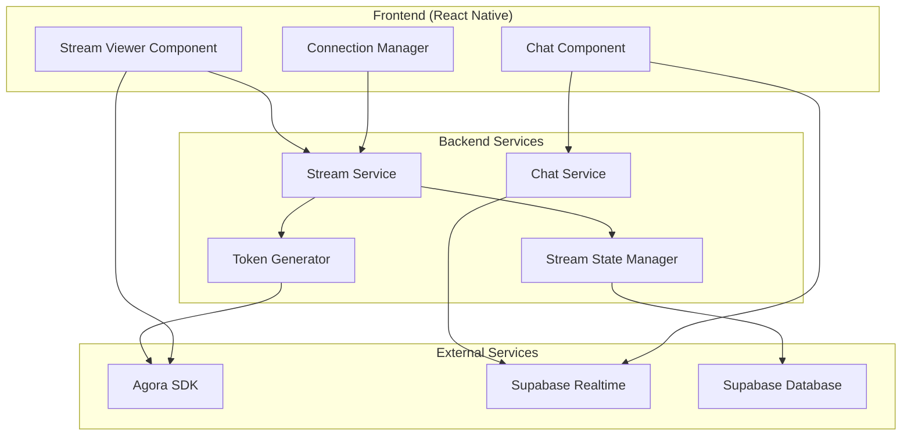
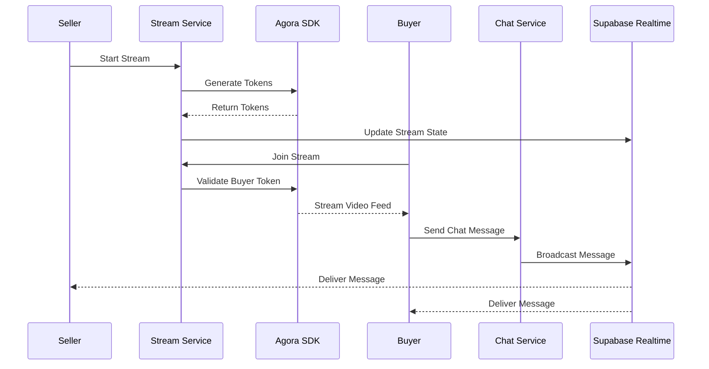

# Design Document: Streaming and Realtime Fixes

## Overview

This design addresses critical streaming and realtime data issues in the live auction platform by implementing comprehensive fixes across the backend streaming services, frontend components, and realtime communication systems. The solution focuses on proper Agora SDK integration, Supabase realtime optimization, and robust error handling to ensure reliable video streaming and chat functionality between sellers and buyers.

## Architecture

### High-Level Architecture



### Component Interaction Flow



## Components and Interfaces

### Stream Service Interface

```typescript
interface StreamService {
  // Stream lifecycle management
  startStream(sellerId: string, auctionId: string): Promise<StreamSession>
  endStream(sessionId: string): Promise<void>
  pauseStream(sessionId: string): Promise<void>
  resumeStream(sessionId: string): Promise<void>
  
  // Token management
  generateSellerToken(sellerId: string, channelId: string): Promise<AgoraToken>
  generateBuyerToken(buyerId: string, channelId: string): Promise<AgoraToken>
  refreshToken(userId: string, channelId: string): Promise<AgoraToken>
  
  // Stream state management
  getStreamState(sessionId: string): Promise<StreamState>
  updateStreamState(sessionId: string, state: StreamState): Promise<void>
  
  // Viewer management
  addViewer(sessionId: string, buyerId: string): Promise<void>
  removeViewer(sessionId: string, buyerId: string): Promise<void>
  getViewerCount(sessionId: string): Promise<number>
}

interface StreamSession {
  id: string
  sellerId: string
  auctionId: string
  channelId: string
  state: StreamState
  createdAt: Date
  viewers: string[]
}

enum StreamState {
  INITIALIZING = 'initializing',
  ACTIVE = 'active',
  PAUSED = 'paused',
  ENDED = 'ended',
  ERROR = 'error'
}

interface AgoraToken {
  token: string
  channelId: string
  uid: number
  expiresAt: Date
  privileges: TokenPrivileges
}

interface TokenPrivileges {
  canPublish: boolean
  canSubscribe: boolean
  canAdmin: boolean
}
```

### Chat Service Interface

```typescript
interface ChatService {
  // Message operations
  sendMessage(sessionId: string, userId: string, content: string): Promise<ChatMessage>
  getMessageHistory(sessionId: string, limit: number, offset: number): Promise<ChatMessage[]>
  
  // Realtime subscriptions
  subscribeToChat(sessionId: string, userId: string): Promise<Subscription>
  unsubscribeFromChat(subscriptionId: string): Promise<void>
  
  // Message synchronization
  syncMessages(sessionId: string, lastMessageId: string): Promise<ChatMessage[]>
  markMessagesAsRead(sessionId: string, userId: string, messageIds: string[]): Promise<void>
}

interface ChatMessage {
  id: string
  sessionId: string
  userId: string
  username: string
  content: string
  timestamp: Date
  messageType: MessageType
}

enum MessageType {
  USER_MESSAGE = 'user_message',
  SYSTEM_MESSAGE = 'system_message',
  AUCTION_UPDATE = 'auction_update'
}

interface Subscription {
  id: string
  sessionId: string
  userId: string
  channel: string
  isActive: boolean
}
```

### Frontend Stream Viewer Component

```typescript
interface StreamViewerProps {
  sessionId: string
  userId: string
  userRole: 'seller' | 'buyer'
  onConnectionStateChange: (state: ConnectionState) => void
  onError: (error: StreamError) => void
}

interface StreamViewerState {
  connectionState: ConnectionState
  videoEnabled: boolean
  audioEnabled: boolean
  streamQuality: StreamQuality
  error: StreamError | null
}

enum ConnectionState {
  DISCONNECTED = 'disconnected',
  CONNECTING = 'connecting',
  CONNECTED = 'connected',
  RECONNECTING = 'reconnecting',
  FAILED = 'failed'
}

enum StreamQuality {
  LOW = 'low',
  MEDIUM = 'medium',
  HIGH = 'high',
  AUTO = 'auto'
}

interface StreamError {
  code: string
  message: string
  recoverable: boolean
  timestamp: Date
}
```

### Connection Manager Interface

```typescript
interface ConnectionManager {
  // Connection lifecycle
  connect(config: ConnectionConfig): Promise<void>
  disconnect(): Promise<void>
  reconnect(): Promise<void>
  
  // Connection monitoring
  getConnectionState(): ConnectionState
  getConnectionQuality(): ConnectionQuality
  
  // Error handling
  handleConnectionError(error: ConnectionError): Promise<void>
  setRetryPolicy(policy: RetryPolicy): void
}

interface ConnectionConfig {
  sessionId: string
  userId: string
  token: string
  enableAutoReconnect: boolean
  maxRetryAttempts: number
  retryDelay: number
}

interface ConnectionQuality {
  latency: number
  packetLoss: number
  bandwidth: number
  quality: 'excellent' | 'good' | 'fair' | 'poor'
}

interface RetryPolicy {
  maxAttempts: number
  baseDelay: number
  maxDelay: number
  backoffMultiplier: number
}
```

## Data Models

### Database Schema Updates

```sql
-- Stream sessions table
CREATE TABLE stream_sessions (
  id UUID PRIMARY KEY DEFAULT gen_random_uuid(),
  seller_id UUID NOT NULL REFERENCES users(id),
  auction_id UUID NOT NULL REFERENCES auctions(id),
  channel_id VARCHAR(255) NOT NULL UNIQUE,
  state VARCHAR(50) NOT NULL DEFAULT 'initializing',
  created_at TIMESTAMP WITH TIME ZONE DEFAULT NOW(),
  started_at TIMESTAMP WITH TIME ZONE,
  ended_at TIMESTAMP WITH TIME ZONE,
  viewer_count INTEGER DEFAULT 0,
  metadata JSONB DEFAULT '{}'
);

-- Stream viewers table
CREATE TABLE stream_viewers (
  id UUID PRIMARY KEY DEFAULT gen_random_uuid(),
  session_id UUID NOT NULL REFERENCES stream_sessions(id),
  user_id UUID NOT NULL REFERENCES users(id),
  joined_at TIMESTAMP WITH TIME ZONE DEFAULT NOW(),
  left_at TIMESTAMP WITH TIME ZONE,
  is_active BOOLEAN DEFAULT true,
  UNIQUE(session_id, user_id)
);

-- Chat messages table (enhanced)
CREATE TABLE chat_messages (
  id UUID PRIMARY KEY DEFAULT gen_random_uuid(),
  session_id UUID NOT NULL REFERENCES stream_sessions(id),
  user_id UUID NOT NULL REFERENCES users(id),
  content TEXT NOT NULL,
  message_type VARCHAR(50) DEFAULT 'user_message',
  created_at TIMESTAMP WITH TIME ZONE DEFAULT NOW(),
  updated_at TIMESTAMP WITH TIME ZONE DEFAULT NOW(),
  metadata JSONB DEFAULT '{}'
);

-- Agora tokens table
CREATE TABLE agora_tokens (
  id UUID PRIMARY KEY DEFAULT gen_random_uuid(),
  user_id UUID NOT NULL REFERENCES users(id),
  session_id UUID NOT NULL REFERENCES stream_sessions(id),
  token_hash VARCHAR(255) NOT NULL,
  channel_id VARCHAR(255) NOT NULL,
  uid INTEGER NOT NULL,
  privileges JSONB NOT NULL,
  expires_at TIMESTAMP WITH TIME ZONE NOT NULL,
  created_at TIMESTAMP WITH TIME ZONE DEFAULT NOW(),
  is_active BOOLEAN DEFAULT true
);

-- Indexes for performance
CREATE INDEX idx_stream_sessions_seller_id ON stream_sessions(seller_id);
CREATE INDEX idx_stream_sessions_state ON stream_sessions(state);
CREATE INDEX idx_stream_viewers_session_id ON stream_viewers(session_id);
CREATE INDEX idx_chat_messages_session_id ON chat_messages(session_id);
CREATE INDEX idx_chat_messages_created_at ON chat_messages(created_at);
CREATE INDEX idx_agora_tokens_user_session ON agora_tokens(user_id, session_id);
```

### Supabase Realtime Configuration

```typescript
interface RealtimeConfig {
  channels: {
    streamUpdates: `stream:${string}` // stream:session_id
    chatMessages: `chat:${string}`    // chat:session_id
    viewerUpdates: `viewers:${string}` // viewers:session_id
  }
  policies: {
    streamUpdates: 'authenticated users can subscribe to streams they have access to'
    chatMessages: 'authenticated users can read/write messages in streams they joined'
    viewerUpdates: 'authenticated users can see viewer counts for active streams'
  }
}
```

## Error Handling

### Error Classification and Recovery

```typescript
enum ErrorCategory {
  NETWORK_ERROR = 'network_error',
  AUTHENTICATION_ERROR = 'authentication_error',
  PERMISSION_ERROR = 'permission_error',
  STREAM_ERROR = 'stream_error',
  CHAT_ERROR = 'chat_error',
  SYSTEM_ERROR = 'system_error'
}

interface ErrorHandler {
  handleError(error: SystemError): Promise<ErrorResolution>
  getRecoveryStrategy(errorType: ErrorCategory): RecoveryStrategy
  logError(error: SystemError, context: ErrorContext): void
}

interface RecoveryStrategy {
  autoRetry: boolean
  maxRetryAttempts: number
  retryDelay: number
  fallbackAction: string
  userNotification: boolean
}

// Specific error handling strategies
const ERROR_RECOVERY_STRATEGIES: Record<ErrorCategory, RecoveryStrategy> = {
  [ErrorCategory.NETWORK_ERROR]: {
    autoRetry: true,
    maxRetryAttempts: 3,
    retryDelay: 2000,
    fallbackAction: 'show_offline_mode',
    userNotification: true
  },
  [ErrorCategory.AUTHENTICATION_ERROR]: {
    autoRetry: false,
    maxRetryAttempts: 0,
    retryDelay: 0,
    fallbackAction: 'redirect_to_login',
    userNotification: true
  },
  [ErrorCategory.STREAM_ERROR]: {
    autoRetry: true,
    maxRetryAttempts: 2,
    retryDelay: 1000,
    fallbackAction: 'show_stream_unavailable',
    userNotification: true
  }
}
```

### Circuit Breaker Pattern

```typescript
interface CircuitBreaker {
  state: 'CLOSED' | 'OPEN' | 'HALF_OPEN'
  failureCount: number
  failureThreshold: number
  timeout: number
  lastFailureTime: Date
  
  execute<T>(operation: () => Promise<T>): Promise<T>
  reset(): void
  trip(): void
}

class StreamServiceCircuitBreaker implements CircuitBreaker {
  // Implementation for protecting stream service calls
  // Opens circuit after 5 consecutive failures
  // Half-open state after 30 seconds
  // Prevents cascade failures
}
```

## Testing Strategy

### Dual Testing Approach

The testing strategy combines unit tests for specific scenarios and property-based tests for comprehensive validation:

**Unit Tests Focus:**
- Specific error conditions and edge cases
- Integration points between services
- Mock external service responses
- Authentication and authorization flows

**Property-Based Tests Focus:**
- Universal properties across all streaming scenarios
- Message ordering and consistency properties
- Token generation and validation properties
- Connection state management properties

**Testing Configuration:**
- Property tests: minimum 100 iterations per test
- Unit tests: focused on critical paths and error conditions
- Integration tests: end-to-end streaming and chat flows
- Load tests: concurrent user scenarios up to 100 streams

**Property-Based Testing Library:**
- **JavaScript/TypeScript**: fast-check library
- Each property test tagged with: **Feature: streaming-realtime-fixes, Property {number}: {property_text}**
- Tests run in CI/CD pipeline with deterministic seeds for reproducibility

## Correctness Properties

*A property is a characteristic or behavior that should hold true across all valid executions of a system-essentially, a formal statement about what the system should do. Properties serve as the bridge between human-readable specifications and machine-verifiable correctness guarantees.*

Based on the prework analysis and property reflection to eliminate redundancy, the following properties validate the critical streaming and realtime functionality:

### Property 1: Token Generation and Validation Consistency
*For any* user (seller or buyer) requesting stream access, the Token_Generator should create valid Agora tokens with appropriate privileges for their role, and the Agora_SDK should accept these properly formatted tokens
**Validates: Requirements 1.1, 1.4, 2.1, 2.4**

### Property 2: Concurrent Token Generation Safety
*For any* number of buyers joining a stream simultaneously, the Stream_Service should generate unique tokens without conflicts and handle concurrent requests safely
**Validates: Requirements 1.5, 2.3**

### Property 3: Token Lifecycle Management
*For any* token approaching expiration or experiencing generation failures, the Token_Generator should refresh tokens automatically and handle failures with appropriate retry logic and error messages
**Validates: Requirements 2.2, 2.3, 2.5**

### Property 4: Video Stream Routing Consistency
*For any* active stream with connected buyers, the Agora_SDK should route video data from seller to all buyers, and the Stream_Viewer should display video feeds without black screens
**Validates: Requirements 1.2, 1.3, 6.2**

### Property 5: Stream State Management Consistency
*For any* stream lifecycle event (start, pause, resume, end, error), the Stream_Service should update Stream_State accurately, notify subscribers, and maintain consistency across network interruptions
**Validates: Requirements 3.1, 3.2, 3.3, 3.4, 3.5**

### Property 6: Chat Message Delivery and Ordering
*For any* chat message sent by any participant, the Chat_Service should broadcast it to all participants immediately, and the Chat_Synchronizer should display all messages in chronological order regardless of network conditions
**Validates: Requirements 4.1, 4.2, 4.4, 4.5**

### Property 7: Chat History and Synchronization
*For any* user joining an active stream, the Chat_Service should provide recent message history, and after network restoration, should synchronize any missed messages maintaining chronological order
**Validates: Requirements 4.3, 4.4, 9.2**

### Property 8: Supabase Realtime Connection Management
*For any* realtime connection attempt, Supabase_Realtime should authenticate users, subscribe to relevant channels, deliver updates within 100ms, and handle subscription errors with exponential backoff
**Validates: Requirements 5.1, 5.2, 5.3, 5.4, 5.5**

### Property 9: Frontend Component Initialization and Adaptation
*For any* Stream_Viewer component load, the frontend should initialize Agora SDK properly, handle connection issues with appropriate UI states, adapt to quality changes automatically, and maintain proper video display during device rotations
**Validates: Requirements 6.1, 6.3, 6.4, 6.5**

### Property 10: Connection Recovery and State Restoration
*For any* network connection drop, the Connection_Manager should attempt reconnection within 5 seconds, restore previous stream and chat state upon successful reconnection, and prioritize critical functions during partial connectivity
**Validates: Requirements 7.1, 7.2, 7.4, 7.5**

### Property 11: Connection Failure Handling
*For any* series of failed reconnection attempts, the Connection_Manager should notify users appropriately and provide manual retry options while maintaining system stability
**Validates: Requirements 7.3**

### Property 12: Backend Performance Consistency
*For any* streaming request or concurrent user load up to 100 streams, the Stream_Service should respond within 200ms for token generation, maintain performance without degradation, and use optimized database queries with proper caching
**Validates: Requirements 8.1, 8.2, 8.3, 8.4, 8.5**

### Property 13: Chat Data Persistence and Consistency
*For any* chat message or bulk message operation, the Chat_Service should persist messages to database immediately, resolve conflicts using timestamp-based ordering, batch operations efficiently, and return paginated history with proper sorting
**Validates: Requirements 9.1, 9.3, 9.4, 9.5**

### Property 14: Stream Session Lifecycle Management
*For any* stream session lifecycle event (start, pause, resume, end, timeout), the Stream_Service should initialize/cleanup resources appropriately, maintain session state correctly, notify participants of changes, and handle session timeouts automatically
**Validates: Requirements 10.1, 10.2, 10.3, 10.4, 10.5**