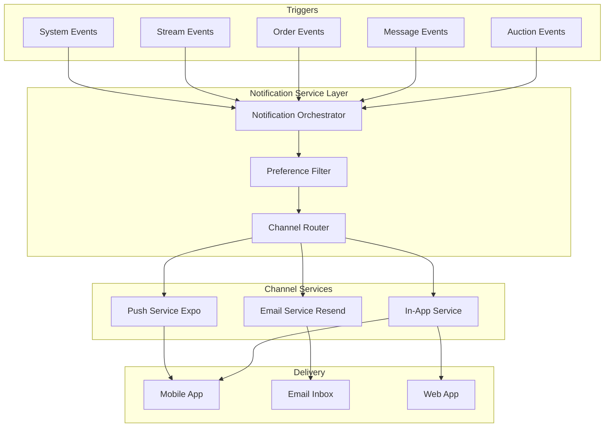

# BarterDash Notification Architecture

## Executive Summary

This document outlines a comprehensive notification system for BarterDash using **Resend** for email delivery, with support for both **in-app** (push notifications) and **off-app** (email) notifications. The architecture supports real-time auction alerts, messaging, order updates, and marketing communications.

---

## Current State Analysis

### Existing Infrastructure

| Component | Current Implementation | Status |
|-----------|----------------------|--------|
| In-App Notifications | [`NotificationsService`](barterdash-backend/src/services/notifications.service.ts:1) with Expo Push API | ✅ Active |
| Email Service | [`EmailService`](barterdash-backend/src/services/email.service.ts:1) using SendGrid | ⚠️ Legacy |
| Push Tokens | [`push_tokens`](barterdash-backend/src/db/schema.ts:985) table | ✅ Active |
| Notification Preferences | [`notificationPreferences`](barterdash-backend/src/db/schema.ts:495) table | ✅ Active |
| Notification History | [`notifications`](barterdash-backend/src/db/schema.ts:670) table | ✅ Active |

### Current Notification Triggers

1. **Auction Won** - [`auctions.service.ts:310-332`](barterdash-backend/src/services/auctions.service.ts:310)
2. **Push Token Registration** - [`notifications.routes.ts:97-122`](barterdash-backend/src/routes/notifications.routes.ts:97)

### Gaps Identified

1. No email notifications for most events (only auction winner gets email)
2. No preference-based filtering (users can't control what they receive)
3. No message notifications when app is backgrounded
4. No scheduled/digest notifications
5. No template management system
6. No delivery tracking or analytics

---

## Why Resend?

### Comparison: SendGrid vs Resend

| Feature | SendGrid (Current) | Resend (Proposed) |
|---------|-------------------|-------------------|
| **Developer Experience** | Complex API, verbose | Simple, modern API |
| **TypeScript Support** | Community types | First-class TypeScript |
| **React Email** | Limited support | Native integration |
| **Deliverability** | Good | Excellent (newer infra) |
| **Pricing** | Tiered, can be expensive | Generous free tier |
| **Webhook Reliability** | Good | Excellent |
| **Template Management** | API-based | Code-based (React Email) |

### Resend Advantages for BarterDash

1. **React Email Integration** - Build beautiful, responsive email templates using React components
2. **Webhook-First** - Excellent delivery tracking via webhooks
3. **Domain Management** - Easy custom domain setup with automatic DNS verification
4. **Broadcast API** - Efficient bulk notifications
5. **Modern SDK** - Clean, promise-based API

---

## Architecture Overview



---

## Database Schema Updates

### 1. Enhanced Notification Preferences

Current table needs expansion:

```typescript
// Update notificationPreferences in schema.ts
export const notificationPreferences = pgTable(
  'notification_preferences',
  {
    userId: uuid('user_id')
      .notNull()
      .references(() => profiles.id, { onDelete: 'cascade' }),
    notificationType: varchar('notification_type', { length: 100 }).notNull(),
    pushEnabled: boolean('push_enabled').default(true).notNull(),
    emailEnabled: boolean('email_enabled').default(true).notNull(),
    smsEnabled: boolean('sms_enabled').default(false).notNull(),
    // NEW: Frequency controls
    frequency: varchar('frequency', { length: 20 }).default('immediate').notNull(), // immediate, digest, none
    digestDay: varchar('digest_day', { length: 10 }), // monday, tuesday, etc.
    // NEW: Quiet hours
    quietHoursStart: integer('quiet_hours_start'), // 0-23
    quietHoursEnd: integer('quiet_hours_end'), // 0-23
    timezone: varchar('timezone', { length: 50 }).default('UTC'),
    createdAt: timestamp('created_at').defaultNow().notNull(),
    updatedAt: timestamp('updated_at').defaultNow().notNull(),
  },
  (table) => ({
    pk: uniqueIndex('notification_preferences_pk').on(table.userId, table.notificationType),
  }),
);
```

### 2. Notification Types Enum

```typescript
// Add to schema.ts
export const notificationTypeEnum = pgEnum('notification_type', [
  // Auction
  'auction_won',
  'auction_outbid',
  'auction_ending_soon',
  'auction_started',
  // Messages
  'new_message',
  // Orders
  'order_confirmed',
  'order_shipped',
  'order_delivered',
  'order_cancelled',
  'payment_received',
  // Streams
  'stream_started',
  'stream_scheduled_reminder',
  'followed_seller_live',
  // Social
  'new_follower',
  'followed_seller_new_product',
  // Account
  'seller_application_status',
  'payout_processed',
  'security_alert',
  // Marketing
  'promotional',
  'newsletter',
]);
```

### 3. Email Delivery Tracking

```typescript
// New table: email_deliveries
export const emailDeliveries = pgTable(
  'email_deliveries',
  {
    id: uuid('id').primaryKey().defaultRandom(),
    userId: uuid('user_id')
      .notNull()
      .references(() => profiles.id, { onDelete: 'cascade' }),
    notificationId: uuid('notification_id')
      .references(() => notifications.id, { onDelete: 'set null' }),
    resendEmailId: varchar('resend_email_id', { length: 255 }), // Resend's ID
    templateName: varchar('template_name', { length: 100 }).notNull(),
    subject: varchar('subject', { length: 500 }).notNull(),
    toEmail: varchar('to_email', { length: 255 }).notNull(),
    status: varchar('status', { length: 50 }).default('pending').notNull(), // pending, sent, delivered, bounced, complained, opened, clicked
    sentAt: timestamp('sent_at'),
    deliveredAt: timestamp('delivered_at'),
    openedAt: timestamp('opened_at'),
    clickedAt: timestamp('clicked_at'),
    errorMessage: text('error_message'),
    metadata: json('metadata').$type<Record<string, any>>().default({}),
    createdAt: timestamp('created_at').defaultNow().notNull(),
  },
  (table) => ({
    userIdx: index('email_deliveries_user_idx').on(table.userId, table.createdAt),
    statusIdx: index('email_deliveries_status_idx').on(table.status),
    resendIdIdx: index('email_deliveries_resend_idx').on(table.resendEmailId),
  }),
);
```

### 4. Notification Queue (for digests)

```typescript
// New table: notification_queue
export const notificationQueue = pgTable(
  'notification_queue',
  {
    id: uuid('id').primaryKey().defaultRandom(),
    userId: uuid('user_id')
      .notNull()
      .references(() => profiles.id, { onDelete: 'cascade' }),
    notificationType: varchar('notification_type', { length: 100 }).notNull(),
    title: varchar('title', { length: 255 }),
    message: text('message').notNull(),
    data: json('data').$type<Record<string, any>>().default({}),
    actionUrl: text('action_url'),
    channel: notificationChannelEnum('channel').default('push').notNull(),
    scheduledFor: timestamp('scheduled_for'), // For digest scheduling
    processedAt: timestamp('processed_at'),
    createdAt: timestamp('created_at').defaultNow().notNull(),
  },
  (table) => ({
    userIdx: index('notification_queue_user_idx').on(table.userId, table.scheduledFor),
    scheduledIdx: index('notification_queue_scheduled_idx').on(table.scheduledFor).where(sql`${table.processedAt} IS NULL`),
  }),
);
```

---

## Backend Implementation

### 1. New Resend Email Service

```typescript
// src/services/resend-email.service.ts
import { Resend } from 'resend';
import { config } from '../config';
import { db, emailDeliveries } from '../db';
import { AppResult, success, failure, ValidationError } from '../utils/result';

// React Email templates (to be created)
import { AuctionWonEmail } from '../emails/auction-won';
import { NewMessageEmail } from '../emails/new-message';
import { OrderUpdateEmail } from '../emails/order-update';
import { StreamStartedEmail } from '../emails/stream-started';

export class ResendEmailService {
  private resend: Resend;
  private fromEmail: string;

  constructor() {
    this.resend = new Resend(config.resendApiKey);
    this.fromEmail = config.fromEmail;
  }

  /**
   * Send auction won notification
   */
  async sendAuctionWon(
    to: string,
    userId: string,
    data: {
      productName: string;
      amount: string;
      orderId: string;
      productImage?: string;
    }
  ): Promise<AppResult<string>> {
    try {
      const { data: emailData, error } = await this.resend.emails.send({
        from: this.fromEmail,
        to,
        subject: `You won ${data.productName}!`,
        react: AuctionWonEmail(data),
      });

      if (error) {
        return failure(new ValidationError(error.message));
      }

      // Track delivery
      await this.trackEmail(userId, 'auction_won', emailData?.id, to, data);

      return success(emailData?.id || '');
    } catch (error) {
      return failure(new ValidationError('Failed to send email'));
    }
  }

  /**
   * Send new message notification
   */
  async sendNewMessage(
    to: string,
    userId: string,
    data: {
      senderName: string;
      messagePreview: string;
      conversationId: string;
      senderAvatar?: string;
    }
  ): Promise<AppResult<string>> {
    try {
      const { data: emailData, error } = await this.resend.emails.send({
        from: this.fromEmail,
        to,
        subject: `New message from ${data.senderName}`,
        react: NewMessageEmail(data),
      });

      if (error) {
        return failure(new ValidationError(error.message));
      }

      await this.trackEmail(userId, 'new_message', emailData?.id, to, data);
      return success(emailData?.id || '');
    } catch (error) {
      return failure(new ValidationError('Failed to send email'));
    }
  }

  /**
   * Send order status update
   */
  async sendOrderUpdate(
    to: string,
    userId: string,
    data: {
      orderNumber: string;
      status: string;
      productName: string;
      trackingNumber?: string;
      carrier?: string;
    }
  ): Promise<AppResult<string>> {
    try {
      const { data: emailData, error } = await this.resend.emails.send({
        from: this.fromEmail,
        to,
        subject: `Order ${data.orderNumber} - ${data.status}`,
        react: OrderUpdateEmail(data),
      });

      if (error) {
        return failure(new ValidationError(error.message));
      }

      await this.trackEmail(userId, 'order_update', emailData?.id, to, data);
      return success(emailData?.id || '');
    } catch (error) {
      return failure(new ValidationError('Failed to send email'));
    }
  }

  /**
   * Send stream started notification
   */
  async sendStreamStarted(
    to: string,
    userId: string,
    data: {
      streamerName: string;
      streamTitle: string;
      streamId: string;
      thumbnailUrl?: string;
    }
  ): Promise<AppResult<string>> {
    try {
      const { data: emailData, error } = await this.resend.emails.send({
        from: this.fromEmail,
        to,
        subject: `${data.streamerName} is live: ${data.streamTitle}`,
        react: StreamStartedEmail(data),
      });

      if (error) {
        return failure(new ValidationError(error.message));
      }

      await this.trackEmail(userId, 'stream_started', emailData?.id, to, data);
      return success(emailData?.id || '');
    } catch (error) {
      return failure(new ValidationError('Failed to send email'));
    }
  }

  /**
   * Send digest email (batch of notifications)
   */
  async sendDigest(
    to: string,
    userId: string,
    data: {
      notifications: Array<{
        type: string;
        title: string;
        message: string;
        actionUrl?: string;
      }>;
      period: string; // 'daily', 'weekly'
    }
  ): Promise<AppResult<string>> {
    try {
      const { data: emailData, error } = await this.resend.emails.send({
        from: this.fromEmail,
        to,
        subject: `Your ${data.period} BarterDash digest`,
        react: DigestEmail(data),
      });

      if (error) {
        return failure(new ValidationError(error.message));
      }

      await this.trackEmail(userId, 'digest', emailData?.id, to, data);
      return success(emailData?.id || '');
    } catch (error) {
      return failure(new ValidationError('Failed to send email'));
    }
  }

  /**
   * Track email delivery in database
   */
  private async trackEmail(
    userId: string,
    templateName: string,
    resendEmailId: string | undefined,
    toEmail: string,
    metadata: Record<string, any>
  ): Promise<void> {
    await db.insert(emailDeliveries).values({
      userId,
      resendEmailId: resendEmailId || null,
      templateName,
      subject: metadata.productName || metadata.subject || 'BarterDash Notification',
      toEmail,
      status: 'sent',
      sentAt: new Date(),
      metadata,
    });
  }

  /**
   * Handle Resend webhook events
   */
  async handleWebhook(event: {
    type: string;
    data: {
      email_id: string;
      [key: string]: any;
    };
  }): Promise<void> {
    const { type, data } = event;
    const emailId = data.email_id;

    // Find the email delivery record
    const delivery = await db.query.emailDeliveries.findFirst({
      where: eq(emailDeliveries.resendEmailId, emailId),
    });

    if (!delivery) return;

    // Update status based on event type
    const updateData: Partial<typeof emailDeliveries.$inferInsert> = {
      status: type,
    };

    switch (type) {
      case 'email.delivered':
        updateData.deliveredAt = new Date();
        break;
      case 'email.opened':
        updateData.openedAt = new Date();
        break;
      case 'email.clicked':
        updateData.clickedAt = new Date();
        break;
      case 'email.bounced':
      case 'email.complained':
        updateData.errorMessage = data.reason || type;
        break;
    }

    await db
      .update(emailDeliveries)
      .set(updateData)
      .where(eq(emailDeliveries.id, delivery.id));
  }
}
```

### 2. Enhanced Notification Service

```typescript
// src/services/notifications.service.ts (Enhanced)
import { NotificationsRepository } from '../repositories/notifications.repository';
import { ResendEmailService } from './resend-email.service';
import { AppResult, success, failure, ValidationError } from '../utils/result';
import { db, pushTokens, notificationPreferences, profiles } from '../db';
import { eq, and, sql } from 'drizzle-orm';

interface CreateNotificationInput {
  userId: string;
  type: string;
  title?: string;
  message: string;
  data?: Record<string, any>;
  actionUrl?: string;
  // NEW: Priority control
  priority?: 'high' | 'normal' | 'low';
  // NEW: Skip channels
  skipPush?: boolean;
  skipEmail?: boolean;
}

export class NotificationsService {
  private notificationsRepository: NotificationsRepository;
  private emailService: ResendEmailService;
  private expoPushUrl = 'https://exp.host/--/api/v2/push/send';

  constructor() {
    this.notificationsRepository = new NotificationsRepository();
    this.emailService = new ResendEmailService();
  }

  /**
   * Main entry point for creating notifications
   * Handles routing to appropriate channels based on user preferences
   */
  async create(input: CreateNotificationInput): Promise<AppResult<any>> {
    // 1. Get user preferences for this notification type
    const preferences = await this.getUserPreferences(input.userId, input.type);

    // 2. Check quiet hours
    const inQuietHours = this.isInQuietHours(preferences);

    // 3. Route to appropriate channels
    const promises: Promise<any>[] = [];

    // In-App (always save for history)
    promises.push(
      this.notificationsRepository.create(
        input.userId,
        input.type,
        input.message,
        input.title,
        input.data,
        input.actionUrl
      )
    );

    // Push Notification (unless skipped or in quiet hours)
    if (!input.skipPush && preferences?.pushEnabled && !inQuietHours) {
      promises.push(
        this.sendPushNotification(input.userId, {
          title: input.title || 'BarterDash',
          body: input.message,
          data: input.data,
        }).catch(err => console.error('Push notification failed:', err))
      );
    }

    // Email (unless skipped or user wants digest)
    if (!input.skipEmail && preferences?.emailEnabled) {
      if (preferences?.frequency === 'digest') {
        // Queue for digest
        promises.push(this.queueForDigest(input));
      } else if (!inQuietHours || input.priority === 'high') {
        // Send immediate email
        promises.push(
          this.sendEmailNotification(input).catch(err =>
            console.error('Email notification failed:', err)
          )
        );
      }
    }

    // Wait for in-app notification to complete
    const [dbResult] = await Promise.all(promises);
    return dbResult;
  }

  /**
   * Get user preferences for a notification type
   */
  private async getUserPreferences(
    userId: string,
    notificationType: string
  ): Promise<any> {
    const prefs = await db.query.notificationPreferences.findFirst({
      where: and(
        eq(notificationPreferences.userId, userId),
        eq(notificationPreferences.notificationType, notificationType)
      ),
    });

    // Return defaults if no custom preferences
    return (
      prefs || {
        pushEnabled: true,
        emailEnabled: true,
        smsEnabled: false,
        frequency: 'immediate',
      }
    );
  }

  /**
   * Check if current time is in user's quiet hours
   */
  private isInQuietHours(preferences: any): boolean {
    if (!preferences?.quietHoursStart || !preferences?.quietHoursEnd) {
      return false;
    }

    const now = new Date();
    const userTimezone = preferences.timezone || 'UTC';

    // Convert to user's timezone
    const userTime = new Date(
      now.toLocaleString('en-US', { timeZone: userTimezone })
    );
    const currentHour = userTime.getHours();

    const start = preferences.quietHoursStart;
    const end = preferences.quietHoursEnd;

    // Handle overnight quiet hours (e.g., 22:00 - 07:00)
    if (start > end) {
      return currentHour >= start || currentHour < end;
    }

    return currentHour >= start && currentHour < end;
  }

  /**
   * Send email notification based on type
   */
  private async sendEmailNotification(
    input: CreateNotificationInput
  ): Promise<void> {
    // Get user's email from Supabase
    const { data: userData } = await supabase.auth.admin.getUserById(
      input.userId
    );
    const email = userData?.user?.email;

    if (!email) {
      console.log(`No email found for user ${input.userId}`);
      return;
    }

    // Route to appropriate email template
    switch (input.type) {
      case 'auction_won':
        await this.emailService.sendAuctionWon(email, input.userId, {
          productName: input.data?.productName || 'Auction Item',
          amount: input.data?.amount || '0',
          orderId: input.data?.orderId,
          productImage: input.data?.productImage,
        });
        break;

      case 'new_message':
        await this.emailService.sendNewMessage(email, input.userId, {
          senderName: input.data?.senderName || 'Someone',
          messagePreview: input.message,
          conversationId: input.data?.conversationId,
          senderAvatar: input.data?.senderAvatar,
        });
        break;

      case 'order_shipped':
      case 'order_delivered':
        await this.emailService.sendOrderUpdate(email, input.userId, {
          orderNumber: input.data?.orderNumber,
          status: input.type.replace('order_', ''),
          productName: input.data?.productName,
          trackingNumber: input.data?.trackingNumber,
          carrier: input.data?.carrier,
        });
        break;

      case 'stream_started':
        await this.emailService.sendStreamStarted(email, input.userId, {
          streamerName: input.data?.streamerName,
          streamTitle: input.title || 'Live Stream',
          streamId: input.data?.streamId,
          thumbnailUrl: input.data?.thumbnailUrl,
        });
        break;

      default:
        // For unhandled types, don't send email
        console.log(`No email template for notification type: ${input.type}`);
    }
  }

  /**
   * Queue notification for digest
   */
  private async queueForDigest(
    input: CreateNotificationInput
  ): Promise<void> {
    // Implementation would add to notification_queue table
    // for later processing by a cron job
    console.log(`Queued notification for digest: ${input.type}`);
  }

  // ... existing push notification methods ...
}
```

### 3. Webhook Handler for Resend

```typescript
// src/routes/webhooks.routes.ts
import { Router, Response, Request } from 'express';
import { ResendEmailService } from '../services/resend-email.service';

const router = Router();
const emailService = new ResendEmailService();

/**
 * POST /webhooks/resend
 * Handle Resend webhook events
 */
router.post(
  '/resend',
  async (req: Request, res: Response) => {
    try {
      const event = req.body;

      // Verify webhook signature (recommended)
      // const signature = req.headers['resend-signature'];
      // verifySignature(event, signature);

      await emailService.handleWebhook(event);

      res.json({ received: true });
    } catch (error) {
      console.error('Resend webhook error:', error);
      res.status(500).json({ error: 'Webhook processing failed' });
    }
  }
);

export default router;
```

### 4. Message Notification Integration

```typescript
// src/services/messaging.service.ts (Enhanced)
import { ConversationsRepository } from '../repositories/conversations.repository';
import { DirectMessagesRepository } from '../repositories/direct-messages.repository';
import { NotificationsService } from './notifications.service';
import { UsersService } from './users.service';
import { AppResult } from '../utils/result';

export class MessagingService {
  private conversationsRepository: ConversationsRepository;
  private directMessagesRepository: DirectMessagesRepository;
  private notificationsService: NotificationsService;
  private usersService: UsersService;

  constructor() {
    this.conversationsRepository = new ConversationsRepository();
    this.directMessagesRepository = new DirectMessagesRepository();
    this.notificationsService = new NotificationsService();
    this.usersService = new UsersService();
  }

  async sendMessage(
    conversationId: string,
    senderId: string,
    content: string,
    data: {
      messageType?: 'text' | 'image' | 'product_link';
      attachmentUrl?: string;
      productId?: string;
    } = {}
  ): Promise<AppResult<any>> {
    // 1. Send the message
    const result = await this.directMessagesRepository.sendMessage(
      conversationId,
      senderId,
      {
        content,
        ...data,
      }
    );

    if (result.isOk()) {
      // 2. Update conversation
      await this.conversationsRepository.updateLastMessage(
        conversationId,
        result.value.id
      );

      // 3. Get conversation to find recipient
      const convResult = await this.conversationsRepository.getConversationById(
        conversationId
      );

      if (convResult.isOk()) {
        const conversation = convResult.value;
        const recipientId = conversation.participantIds.find(
          (id: string) => id !== senderId
        );

        if (recipientId) {
          // 4. Get sender info for notification
          const senderResult = await this.usersService.getUserProfile(senderId);
          const senderName = senderResult.isOk()
            ? senderResult.value.username
            : 'Someone';

          // 5. Send notification
          await this.notificationsService.create({
            userId: recipientId,
            type: 'new_message',
            title: `New message from ${senderName}`,
            message: content.substring(0, 100) + (content.length > 100 ? '...' : ''),
            data: {
              conversationId,
              senderId,
              senderName,
              messageId: result.value.id,
            },
            actionUrl: `/messages/${conversationId}`,
          });
        }
      }
    }

    return result;
  }
}
```

---

## Frontend Implementation

### 1. Push Notification Setup (Expo)

```typescript
// barterdash-mobile/lib/notifications/pushNotifications.ts
import * as Notifications from 'expo-notifications';
import * as Device from 'expo-device';
import { Platform } from 'react-native';
import { notificationsService } from '../api/services/notifications';

// Configure notification handler
Notifications.setNotificationHandler({
  handleNotification: async () => ({
    shouldShowAlert: true,
    shouldPlaySound: true,
    shouldSetBadge: true,
  }),
});

/**
 * Register for push notifications
 */
export async function registerForPushNotificationsAsync(): Promise<string | null> {
  let token: string | null = null;

  if (Platform.OS === 'android') {
    await Notifications.setNotificationChannelAsync('default', {
      name: 'default',
      importance: Notifications.AndroidImportance.MAX,
      vibrationPattern: [0, 250, 250, 250],
      lightColor: '#FACC15',
    });
  }

  if (Device.isDevice) {
    const { status: existingStatus } = await Notifications.getPermissionsAsync();
    let finalStatus = existingStatus;

    if (existingStatus !== 'granted') {
      const { status } = await Notifications.requestPermissionsAsync();
      finalStatus = status;
    }

    if (finalStatus !== 'granted') {
      console.log('Failed to get push token permission');
      return null;
    }

    // Get Expo push token
    const expoToken = (await Notifications.getExpoPushTokenAsync({
      projectId: 'your-project-id', // From app.json
    })).data;

    token = expoToken;

    // Register with backend
    const platform = Platform.OS as 'ios' | 'android';
    await notificationsService.registerPushToken(token, platform);
  } else {
    console.log('Must use physical device for Push Notifications');
  }

  return token;
}

/**
 * Unregister push notifications
 */
export async function unregisterPushNotificationsAsync(): Promise<void> {
  const token = (await Notifications.getExpoPushTokenAsync()).data;
  await notificationsService.unregisterPushToken(token);
}

/**
 * Listen for incoming notifications
 */
export function addNotificationListeners(
  onNotification: (notification: Notifications.Notification) => void,
  onNotificationResponse: (response: Notifications.NotificationResponse) => void
): {
  subscription: Notifications.Subscription;
  responseSubscription: Notifications.Subscription;
} {
  // Foreground notifications
  const subscription = Notifications.addNotificationReceivedListener(
    onNotification
  );

  // User taps notification
  const responseSubscription = Notifications.addNotificationResponseReceivedListener(
    onNotificationResponse
  );

  return { subscription, responseSubscription };
}

/**
 * Remove notification listeners
 */
export function removeNotificationListeners(
  subscription: Notifications.Subscription,
  responseSubscription: Notifications.Subscription
): void {
  Notifications.removeNotificationSubscription(subscription);
  Notifications.removeNotificationSubscription(responseSubscription);
}
```

### 2. Notification Provider

```typescript
// barterdash-mobile/context/NotificationContext.tsx
import React, { createContext, useContext, useEffect, useState } from 'react';
import * as Notifications from 'expo-notifications';
import { useRouter } from 'expo-router';
import {
  registerForPushNotificationsAsync,
  addNotificationListeners,
  removeNotificationListeners,
} from '../lib/notifications/pushNotifications';
import { useAuthStore } from '../store/authStore';
import { Notification } from '../lib/api/services/notifications';

interface NotificationContextType {
  expoPushToken: string | null;
  unreadCount: number;
  notifications: Notification[];
  refreshNotifications: () => Promise<void>;
  markAsRead: (id: string) => Promise<void>;
  markAllAsRead: () => Promise<void>;
}

const NotificationContext = createContext<NotificationContextType | undefined>(
  undefined
);

export function NotificationProvider({
  children,
}: {
  children: React.ReactNode;
}) {
  const router = useRouter();
  const { isAuthenticated } = useAuthStore();
  const [expoPushToken, setExpoPushToken] = useState<string | null>(null);
  const [unreadCount, setUnreadCount] = useState(0);
  const [notifications, setNotifications] = useState<Notification[]>([]);

  useEffect(() => {
    if (!isAuthenticated) return;

    // Register for push notifications
    registerForPushNotificationsAsync().then((token) => {
      setExpoPushToken(token);
    });

    // Add listeners
    const { subscription, responseSubscription } = addNotificationListeners(
      (notification) => {
        // Handle foreground notification
        console.log('Notification received:', notification);
        refreshNotifications();
      },
      (response) => {
        // Handle notification tap
        const data = response.notification.request.content.data;
        handleNotificationTap(data);
      }
    );

    // Initial load
    refreshNotifications();

    return () => {
      removeNotificationListeners(subscription, responseSubscription);
    };
  }, [isAuthenticated]);

  const handleNotificationTap = (data: any) => {
    // Route based on notification type
    switch (data.type) {
      case 'new_message':
        router.push(`/messages/${data.conversationId}`);
        break;
      case 'auction_won':
        router.push(`/orders/${data.orderId}`);
        break;
      case 'stream_started':
        router.push(`/stream/${data.streamId}`);
        break;
      case 'order_shipped':
      case 'order_delivered':
        router.push(`/orders/${data.orderId}`);
        break;
      default:
        router.push('/notifications');
    }
  };

  const refreshNotifications = async () => {
    try {
      const { notificationsService } = await import(
        '../lib/api/services/notifications'
      );
      const [notifs, count] = await Promise.all([
        notificationsService.getNotifications(),
        notificationsService.getUnreadCount(),
      ]);
      setNotifications(notifs);
      setUnreadCount(count);
    } catch (error) {
      console.error('Failed to refresh notifications:', error);
    }
  };

  const markAsRead = async (id: string) => {
    try {
      const { notificationsService } = await import(
        '../lib/api/services/notifications'
      );
      await notificationsService.markAsRead(id);
      setUnreadCount((prev) => Math.max(0, prev - 1));
      setNotifications((prev) =>
        prev.map((n) => (n.id === id ? { ...n, isRead: true } : n))
      );
    } catch (error) {
      console.error('Failed to mark notification as read:', error);
    }
  };

  const markAllAsRead = async () => {
    try {
      const { notificationsService } = await import(
        '../lib/api/services/notifications'
      );
      await notificationsService.markAllAsRead();
      setUnreadCount(0);
      setNotifications((prev) =>
        prev.map((n) => ({ ...n, isRead: true }))
      );
    } catch (error) {
      console.error('Failed to mark all notifications as read:', error);
    }
  };

  return (
    <NotificationContext.Provider
      value={{
        expoPushToken,
        unreadCount,
        notifications,
        refreshNotifications,
        markAsRead,
        markAllAsRead,
      }}
    >
      {children}
    </NotificationContext.Provider>
  );
}

export function useNotifications() {
  const context = useContext(NotificationContext);
  if (!context) {
    throw new Error(
      'useNotifications must be used within a NotificationProvider'
    );
  }
  return context;
}
```

### 3. Notifications Screen

```typescript
// barterdash-mobile/app/(tabs)/notifications.tsx (New file)
import React from 'react';
import {
  FlatList,
  RefreshControl,
  Pressable,
} from 'react-native';
import { SafeAreaView } from 'react-native-safe-area-context';
import { useRouter } from 'expo-router';
import {
  Box,
  Text,
  VStack,
  HStack,
  Center,
  Spinner,
  Heading,
  Badge,
} from '@gluestack-ui/themed';
import { Bell, Package, MessageCircle, Gavel, Video } from 'lucide-react-native';
import { useNotifications } from '@/context/NotificationContext';
import { theme } from '@/constants/theme';

const notificationIcons: Record<string, any> = {
  auction_won: Gavel,
  new_message: MessageCircle,
  order_shipped: Package,
  order_delivered: Package,
  stream_started: Video,
  default: Bell,
};

export default function NotificationsScreen() {
  const router = useRouter();
  const {
    notifications,
    unreadCount,
    refreshNotifications,
    markAsRead,
  } = useNotifications();
  const [refreshing, setRefreshing] = React.useState(false);

  const handleNotificationPress = (notification: any) => {
    // Mark as read
    if (!notification.isRead) {
      markAsRead(notification.id);
    }

    // Navigate based on type
    const data = notification.data || {};
    switch (notification.type) {
      case 'new_message':
        router.push(`/messages/${data.conversationId}`);
        break;
      case 'auction_won':
        router.push(`/orders/${data.orderId}`);
        break;
      case 'stream_started':
        router.push(`/stream/${data.streamId}`);
        break;
      case 'order_shipped':
      case 'order_delivered':
        router.push(`/orders/${data.orderId}`);
        break;
      default:
        if (notification.actionUrl) {
          router.push(notification.actionUrl);
        }
    }
  };

  const renderNotification = ({ item }: { item: any }) => {
    const Icon = notificationIcons[item.type] || notificationIcons.default;
    const isUnread = !item.isRead;

    return (
      <Pressable
        onPress={() => handleNotificationPress(item)}
        style={{
          padding: 16,
          backgroundColor: isUnread ? '#F3F4F6' : '#FFFFFF',
          borderBottomWidth: 1,
          borderBottomColor: '#E5E7EB',
        }}
      >
        <HStack space="md" alignItems="flex-start">
          <Center
            w={40}
            h={40}
            rounded="full"
            bg={theme.colors.accent}
          >
            <Icon size={20} color={theme.colors.secondary} />
          </Center>
          <VStack flex={1} space="xs">
            <HStack justifyContent="space-between" alignItems="center">
              <Text
                fontWeight={isUnread ? '$bold' : '$semibold'}
                color={theme.colors.text}
              >
                {item.title || 'Notification'}
              </Text>
              {isUnread && (
                <Badge bg={theme.colors.accent} rounded="full">
                  <Text size="xs" color={theme.colors.secondary}>
                    New
                  </Text>
                </Badge>
              )}
            </HStack>
            <Text color={theme.colors.textMuted} size="sm">
              {item.message}
            </Text>
            <Text color={theme.colors.textMuted} size="xs">
              {new Date(item.createdAt).toLocaleDateString()}
            </Text>
          </VStack>
        </HStack>
      </Pressable>
    );
  };

  return (
    <SafeAreaView style={{ flex: 1, backgroundColor: '#FFFFFF' }}>
      <Box p="$4" borderBottomWidth={1} borderColor="#E5E7EB">
        <HStack justifyContent="space-between" alignItems="center">
          <Heading size="xl">Notifications</Heading>
          {unreadCount > 0 && (
            <Badge bg={theme.colors.accent} rounded="full" px="$3">
              <Text color={theme.colors.secondary} fontWeight="$bold">
                {unreadCount} new
              </Text>
            </Badge>
          )}
        </HStack>
      </Box>

      <FlatList
        data={notifications}
        renderItem={renderNotification}
        keyExtractor={(item) => item.id}
        refreshControl={
          <RefreshControl
            refreshing={refreshing}
            onRefresh={() => {
              setRefreshing(true);
              refreshNotifications().then(() => setRefreshing(false));
            }}
            tintColor={theme.colors.accent}
          />
        }
        ListEmptyComponent={() => (
          <Center flex={1} p="$10">
            <Bell size={48} color={theme.colors.textMuted} />
            <Text color={theme.colors.textMuted} mt="$4" textAlign="center">
              No notifications yet
            </Text>
          </Center>
        )}
      />
    </SafeAreaView>
  );
}
```

---

## In-App vs Off-App Strategy

### In-App Notifications (Push)

**Use Cases:**
- Real-time auction outbid alerts
- New messages while app is backgrounded
- Stream started (for followed sellers)
- Time-sensitive order updates

**Implementation:**
- Expo Push API for delivery
- Stored in [`notifications`](barterdash-backend/src/db/schema.ts:670) table
- Badge count on app icon
- In-app notification center

### Off-App Notifications (Email)

**Use Cases:**
- Auction won (requires action)
- Order confirmations and updates
- Weekly digest of activity
- Marketing/promotional (opt-in)
- Security alerts

**Implementation:**
- Resend for delivery
- React Email templates
- Delivery tracking via webhooks
- Unsubscribe support

### Channel Decision Matrix

| Event Type | In-App | Email | SMS | Notes |
|------------|--------|-------|-----|-------|
| Auction Won | ✅ | ✅ | ❌ | High priority - both channels |
| Outbid | ✅ | ❌ | ❌ | Real-time, app only |
| New Message | ✅ | ✅* | ❌ | *After 5 min if unread |
| Order Shipped | ✅ | ✅ | ❌ | Both channels |
| Stream Started | ✅ | ✅* | ❌ | *Digest if not urgent |
| Follower | ✅ | ❌ | ❌ | Low priority |
| Digest | ❌ | ✅ | ❌ | Email only |

---

## Email Templates (React Email)

### 1. Auction Won Email

```tsx
// barterdash-backend/src/emails/auction-won.tsx
import {
  Body,
  Button,
  Container,
  Head,
  Heading,
  Html,
  Img,
  Preview,
  Section,
  Text,
} from '@react-email/components';

interface AuctionWonEmailProps {
  productName: string;
  amount: string;
  orderId: string;
  productImage?: string;
}

export function AuctionWonEmail({
  productName,
  amount,
  orderId,
  productImage,
}: AuctionWonEmailProps) {
  return (
    <Html>
      <Head />
      <Preview>Congratulations! You won {productName}</Preview>
      <Body style={main}>
        <Container style={container}>
          <Heading style={h1}>🎉 You Won!</Heading>

          {productImage && (
            
          )}

          <Text style={text}>
            Congratulations! You won the auction for <strong>{productName}</strong>.
          </Text>

          <Section style={priceSection}>
            <Text style={priceLabel}>Winning Bid</Text>
            <Text style={price}>${amount}</Text>
          </Section>

          <Text style={text}>
            Your order has been automatically created. Complete your purchase to ensure fast delivery.
          </Text>

          <Button
            href={`https://barterdash.com/orders/${orderId}`}
            style={button}
          >
            View Order
          </Button>

          <Text style={footer}>
            Thank you for using BarterDash!
          </Text>
        </Container>
      </Body>
    </Html>
  );
}

const main = {
  backgroundColor: '#f6f9fc',
  fontFamily: '-apple-system, BlinkMacSystemFont, "Segoe UI", Roboto, sans-serif',
};

const container = {
  backgroundColor: '#ffffff',
  margin: '0 auto',
  padding: '40px 20px',
  maxWidth: '600px',
};

const h1 = {
  color: '#6366f1',
  fontSize: '32px',
  fontWeight: 'bold',
  margin: '0 0 20px',
  textAlign: 'center' as const,
};

const text = {
  color: '#333',
  fontSize: '16px',
  lineHeight: '24px',
  margin: '0 0 20px',
};

const priceSection = {
  backgroundColor: '#f3f4f6',
  borderRadius: '8px',
  padding: '20px',
  textAlign: 'center' as const,
  margin: '20px 0',
};

const priceLabel = {
  color: '#6b7280',
  fontSize: '14px',
  margin: '0 0 8px',
};

const price = {
  color: '#111827',
  fontSize: '28px',
  fontWeight: 'bold',
  margin: '0',
};

const button = {
  backgroundColor: '#6366f1',
  borderRadius: '8px',
  color: '#ffffff',
  display: 'block',
  fontSize: '16px',
  fontWeight: 'bold',
  padding: '16px 32px',
  textAlign: 'center' as const,
  textDecoration: 'none',
  margin: '20px 0',
};

const footer = {
  color: '#6b7280',
  fontSize: '14px',
  marginTop: '40px',
  textAlign: 'center' as const,
};

export default AuctionWonEmail;
```

### 2. New Message Email

```tsx
// barterdash-backend/src/emails/new-message.tsx
import {
  Body,
  Button,
  Container,
  Head,
  Heading,
  Html,
  Img,
  Preview,
  Section,
  Text,
} from '@react-email/components';

interface NewMessageEmailProps {
  senderName: string;
  messagePreview: string;
  conversationId: string;
  senderAvatar?: string;
}

export function NewMessageEmail({
  senderName,
  messagePreview,
  conversationId,
  senderAvatar,
}: NewMessageEmailProps) {
  return (
    <Html>
      <Head />
      <Preview>New message from {senderName}</Preview>
      <Body style={main}>
        <Container style={container}>
          <Section style={header}>
            {senderAvatar ? (
              
            ) : (
              <div style={avatarPlaceholder}>
                {senderName[0].toUpperCase()}
              </div>
            )}
            <Heading style={h1}>{senderName} sent you a message</Heading>
          </Section>

          <Section style={messageBox}>
            <Text style={messageText}>{messagePreview}</Text>
          </Section>

          <Button
            href={`https://barterdash.com/messages/${conversationId}`}
            style={button}
          >
            Reply
          </Button>

          <Text style={footer}>
            You received this email because you have message notifications enabled.
          </Text>
        </Container>
      </Body>
    </Html>
  );
}

// Styles...
const main = {
  backgroundColor: '#f6f9fc',
  fontFamily: '-apple-system, BlinkMacSystemFont, "Segoe UI", Roboto, sans-serif',
};

const container = {
  backgroundColor: '#ffffff',
  margin: '0 auto',
  padding: '40px 20px',
  maxWidth: '600px',
};

const header = {
  textAlign: 'center' as const,
  marginBottom: '30px',
};

const avatar = {
  width: '64px',
  height: '64px',
  borderRadius: '50%',
  margin: '0 auto 16px',
};

const avatarPlaceholder = {
  width: '64px',
  height: '64px',
  borderRadius: '50%',
  backgroundColor: '#6366f1',
  color: '#ffffff',
  display: 'flex',
  alignItems: 'center',
  justifyContent: 'center',
  fontSize: '24px',
  fontWeight: 'bold',
  margin: '0 auto 16px',
};

const h1 = {
  color: '#111827',
  fontSize: '24px',
  fontWeight: 'bold',
  margin: '0',
};

const messageBox = {
  backgroundColor: '#f3f4f6',
  borderRadius: '8px',
  padding: '20px',
  margin: '20px 0',
};

const messageText = {
  color: '#374151',
  fontSize: '16px',
  lineHeight: '24px',
  margin: '0',
  fontStyle: 'italic',
};

const button = {
  backgroundColor: '#6366f1',
  borderRadius: '8px',
  color: '#ffffff',
  display: 'block',
  fontSize: '16px',
  fontWeight: 'bold',
  padding: '16px 32px',
  textAlign: 'center' as const,
  textDecoration: 'none',
  margin: '20px 0',
};

const footer = {
  color: '#6b7280',
  fontSize: '14px',
  marginTop: '40px',
  textAlign: 'center' as const,
};

export default NewMessageEmail;
```

---

## Configuration

### Environment Variables

```bash
# .env (backend)
# Resend (replacing SendGrid)
RESEND_API_KEY=re_xxxxxxxxxxxxxxx
FROM_EMAIL=notifications@barterdash.com
FROM_NAME=BarterDash

# (Optional) Resend Webhook Secret for verification
RESEND_WEBHOOK_SECRET=whsec_xxxxxxxxxxxxxxx

# Remove or deprecate SendGrid
# SENDGRID_API_KEY=SG.xxxxxx  # Deprecated
```

### Package Installation

```bash
# Backend
cd barterdash-backend
npm install resend @react-email/components @react-email/render
npm uninstall @sendgrid/mail  # Remove SendGrid

# Mobile app
cd barterdash-mobile
npx expo install expo-notifications expo-device
```

---

## Migration Plan

### Phase 1: Setup (Week 1)
- [ ] Install Resend and React Email packages
- [ ] Create Resend account and verify domain
- [ ] Create base email templates
- [ ] Update environment configuration

### Phase 2: Core Implementation (Week 2)
- [ ] Implement ResendEmailService
- [ ] Create webhook handler
- [ ] Update NotificationService with channel routing
- [ ] Add preference filtering

### Phase 3: Feature Integration (Week 3)
- [ ] Message notifications
- [ ] Order notifications
- [ ] Stream notifications
- [ ] Auction notifications

### Phase 4: Mobile Implementation (Week 4)
- [ ] Push notification setup
- [ ] Notification provider
- [ ] Notifications screen
- [ ] Deep linking

### Phase 5: Testing & Rollout (Week 5)
- [ ] Test all notification types
- [ ] Verify email deliverability
- [ ] Monitor webhook events
- [ ] Gradual rollout to users

### Phase 6: Deprecation (Week 6)
- [ ] Remove SendGrid integration
- [ ] Migrate any remaining templates
- [ ] Update documentation

---

## Monitoring & Analytics

### Key Metrics

| Metric | Source | Alert Threshold |
|--------|--------|-----------------|
| Email Delivery Rate | Resend webhooks | < 95% |
| Email Open Rate | Resend analytics | < 20% |
| Push Delivery Rate | Expo receipts | < 90% |
| Notification Queue Size | Database | > 1000 |
| Webhook Processing Time | Application logs | > 5s |

### Dashboard Queries

```sql
-- Email delivery stats by template
SELECT
  template_name,
  COUNT(*) as total_sent,
  SUM(CASE WHEN status = 'delivered' THEN 1 ELSE 0 END) as delivered,
  SUM(CASE WHEN status = 'opened' THEN 1 ELSE 0 END) as opened,
  SUM(CASE WHEN status = 'bounced' THEN 1 ELSE 0 END) as bounced,
  ROUND(
    100.0 * SUM(CASE WHEN status = 'delivered' THEN 1 ELSE 0 END) / COUNT(*),
    2
  ) as delivery_rate
FROM email_deliveries
WHERE created_at > NOW() - INTERVAL '7 days'
GROUP BY template_name;

-- Notifications by type
SELECT
  type,
  channel,
  COUNT(*) as count,
  SUM(CASE WHEN is_read THEN 1 ELSE 0 END) as read_count
FROM notifications
WHERE created_at > NOW() - INTERVAL '7 days'
GROUP BY type, channel;
```

---

## Security Considerations

1. **Webhook Verification** - Verify Resend webhook signatures
2. **Email Rate Limiting** - Prevent abuse (max 100 emails/hour per user)
3. **Unsubscribe** - Honor unsubscribe requests immediately
4. **PII Protection** - Don't include sensitive data in notification payloads
5. **Token Security** - Securely store push tokens, rotate on logout

---

## Conclusion

This architecture provides a robust, scalable notification system that:

- **Respects user preferences** with granular controls
- **Delivers reliably** via Resend for email and Expo for push
- **Tracks engagement** with comprehensive analytics
- **Supports growth** with digest options and queue management
- **Maintains quality** with React Email templates

The phased migration ensures minimal disruption while modernizing the notification infrastructure.
